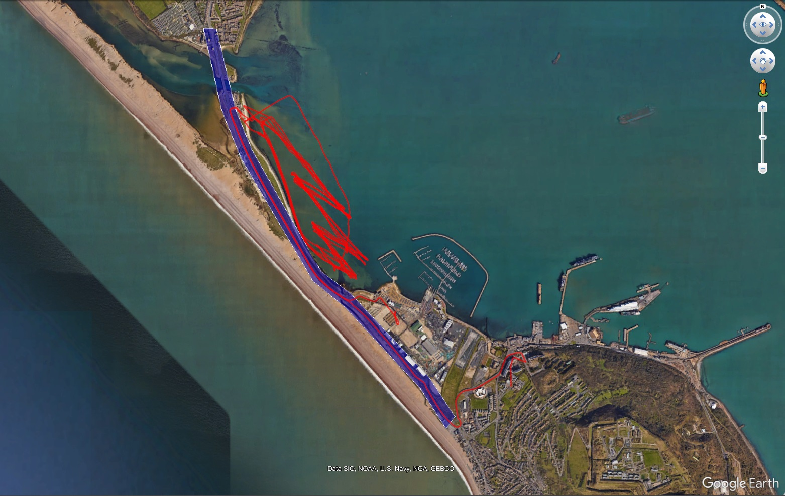

## GT-31

### Weymouth Speed Week

The folder "wsw" contains 10 files that were identified using a Python script within the [GPS Wizard](https://logiqx.github.io/gps-wizard/) project.

#### Method

The Python script processes all of the historical SBN files, searching for speeds in excess of 40 knots. Geofencing is applied so that vehicle speeds in excess of 40 knots are ignored. The results include files where the board speed exceeded 40 knots, plus files containing spikes in excess of 40 knots.

The image below illustrates the geofencing, marked in blue:

#### Results

Summary of the processing:

- Total files = 2,725
- Total points = 12,110,508
- Total distance = 83,014.53 km

27 of the files included speeds in excess of 40 knots, equating to around 1% of the files. More than half of these files contained genuine speeds on the water and two of the files included speeds of motor vehicles that were several miles away.

The remaining 10 files contained spikes in excess of 40 knots. The spikes within these files are all handled by the existing software filters. The table below lists the 10 files containing spikes and the filters applied by GPS Speedreader:

| File                                       | m/s    | knots  | km/h    | Filters | sAcc  | Sats | HDOP |
| ------------------------------------------ | -----: | -----: | ------: | :-----: | ----: | :--: | --: |
| 206MALLMAN_113200495_20111018_131156.SBN   | 24.65  | 47.92  | 88.74   | T       | 1.827 | 9    | 1.2  |
| CONNE2GARRY_133200827_20191009_102438.SBN  | 29.95  | 58.22  | 107.82  | TS      | 1.497 | 4    | 2.2  |
| GARRE67DAVID_103201606_20121009_145611.SBN | 20.63  | 40.10  | 74.27   | TS      | 1.497 | 4    | 2.2  |
| Hardy41James_932000585_20151006_095149.SBN | 22.19  | 43.13  | 79.88   | T+      | 2.780 | 6    | 2.0  |
| Jenki36Paul_932000540_20171015_095602.SBN  | 24.64  | 47.90  | 88.70   | TS+     | 4.957 | 4    | 2.8  |
| K888_123201112_20121009_085502.SBN         | 42.04  | 81.72  | 151.34  | TA+     | 3.071 | 7    | 0.8  |
| Penna65Robin_113200494_20141023_090602.SBN | 21.75  | 42.28  | 78.30   | T+      | 2.605 | 7    | 1.2  |
| WIGGAWOOKIE_123201104_20121010_100627.SBN  | 40.32  | 78.38  | 145.15  | T+      | 2.449 | 6    | 1.6  |
| WSW  18_932000559_20121009_104151.SBN      | 29.89  | 58.10  | 107.60  | T+      | 4.957 | 5    | 3.0  |
| WSWAFOUR_932000173_20121009_092850.SBN     | 398.44 | 774.51 | 1434.38 | A       | 1.419 | 8    | 1.0  |

The filters applied by GPS Speedreader are as follows:

- T = time difference > 1 second
- S = number of satellites < 5
- \+ = standard deviation of speed (SDOS) > 2.0 m/s
- A = acceleration > 4 m/s

#### Conclusions

The GT-31 doesn't produce a lot of large spikes on the water. Only 0.37% of the WSW files between 2011 and 2022 contained spikes in excess of 40 knots.

Existing software filters are very capable of eliminating these spikes from calculated results, so no further work is required.
