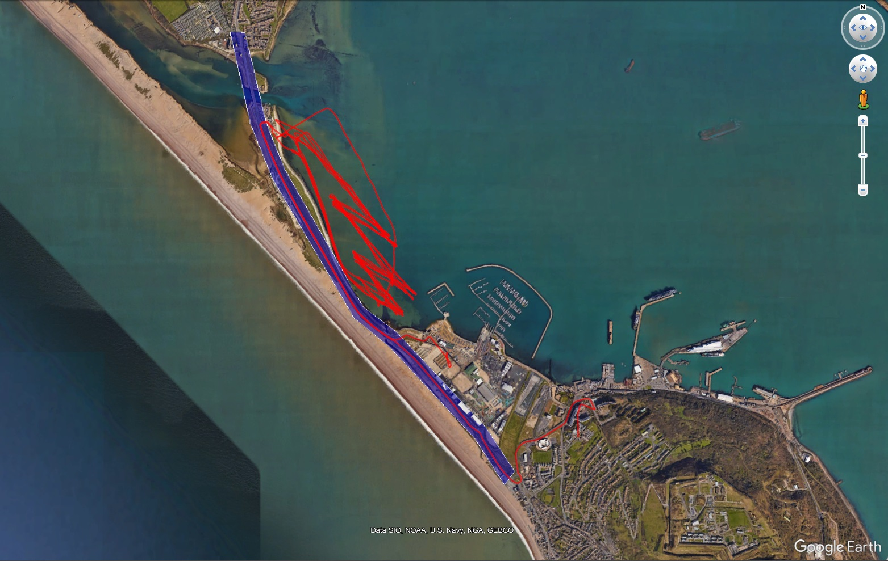
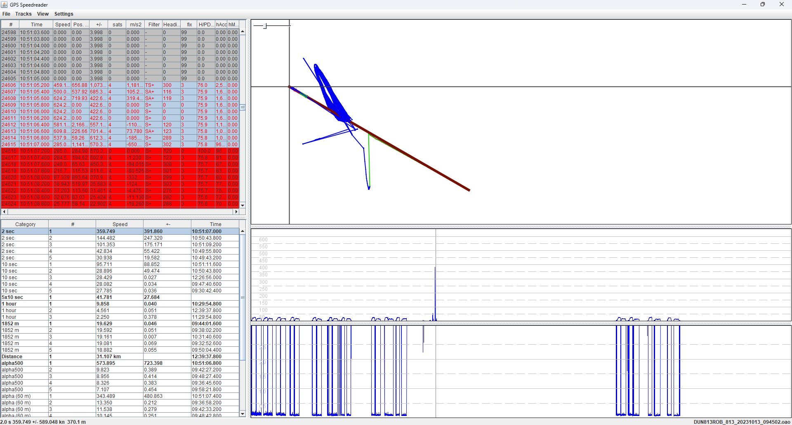

## Weymouth Speed Week

### Motion Mini

The "wsw" folder contains 75 files that were identified using a Python script within the [GPS Wizard](https://logiqx.github.io/gps-wizard/) project.

#### Method

The Python script processes all of the OAO files from 2022 and 2023, searching for speeds in excess of 40 knots. Geofencing is applied so that vehicle speeds in excess of 40 knots are ignored. The results include files where the board speed exceeded 40 knots, plus files containing spikes in excess of 40 knots.

The image below illustrates the geofencing, marked in blue:

#### Results

Summary of the processing:

- Total OAO files = 361
- Total points = 8,192,357
- Total distance = 13,333.35 km

12 of these files contain genuine 40 knot speeds whilst afloat, and one file includes a vehicle journey that was several miles away. These files are easily identified by the low values for sAcc / hAcc / HDOP and 19+ satellites, whilst 40+ knots was being reported.

75 files contain spikes in excess of 40 knots, equating to 20% of the files scanned. Just 3 of the files contain spikes whilst afloat, but 72 of the files contain spikes whilst ashore. The majority of the spikes whilst ashore are due to the the Motions being inside the WPNSA building.

The following table lists the 75 files containing spikes in excess of 40 knots (72 afloat and 3 ashore), plus the accuracy estimates at the time:

| File                              |    m/s |  knots |    km/h | sAcc (m/s) | hAcc (m) |  HDOP | Sats |
| --------------------------------- | -----: | -----: | ------: | ---------: | -------: | ----: | :--: |
| ADC838MIA_838_20231007_104540.oao |  49.43 |  96.09 |  177.96 |      92.77 |   814.53 | 55.40 |  5   |
| ARN833PAU_833_20231013_092448.oao | 153.37 | 298.13 |  552.14 |     906.43 |  9908.97 | 99.99 |  4   |
| BUK829MAC_829_20231013_082820.oao |  46.63 |  90.64 |  167.87 |      81.64 |  1124.23 | 40.94 |  4   |
| BUL841JAM_841_20231012_095438.oao | 353.91 | 687.94 | 1274.07 |     328.29 |  1261.58 | 83.72 |  4   |
| BUR107EMI_625_20221016_152748.oao |  37.73 |  73.33 |  135.81 |      25.59 |   383.55 | 14.31 |  6   |
| CAR109MAR_631_20221021_100410.oao |  26.04 |  50.62 |   93.75 |      45.12 |   764.81 | 32.99 |  6   |
| CAR853MAR_853_20231011_113150.oao |  72.43 | 140.80 |  260.76 |     290.57 |  1986.90 | 85.69 |  4   |
| CHA827FIN_827_20231007_093610.oao | 155.13 | 301.55 |  558.48 |     455.69 |  2716.89 | 77.82 |  4   |
| CHI822DYL_822_20231007_103210.oao | 225.57 | 438.47 |  812.04 |     999.00 | 12623.47 | 99.99 |  4   |
| COL872AND_872_20231013_091534.oao | 182.29 | 354.35 |  656.25 |     431.18 |  1038.16 | 68.80 |  4   |
| CON113GAR_635_20221016_145222.oao |  41.62 |  80.90 |  149.82 |      40.05 |   468.51 | 14.52 |  6   |
| CRI858GUY_858_20231011_100701.oao |  53.90 | 104.77 |  194.04 |      57.25 |  1110.90 | 27.57 |  4   |
| CRO632PET_632_20231013_092740.oao | 167.42 | 325.44 |  602.71 |     165.13 |  1711.09 | 48.72 |  4   |
| CRO634RIC_634_20231012_145908.oao |  26.47 |  51.45 |   95.29 |      17.76 |   222.53 |  9.43 |  6   |
| CRO825JIM_825_20231011_100208.oao | 110.88 | 215.54 |  399.17 |      61.63 |   489.67 | 30.80 |  4   |
| CRO825JIM_825_20231013_085212.oao | 112.20 | 218.10 |  403.92 |      83.01 |  1176.92 | 78.66 |  4   |
| DAR869HEL_869_20231012_142302.oao |  25.33 |  49.23 |   91.18 |      18.89 |   300.51 | 22.43 |  4   |
| DAR869HEL_869_20231013_092302.oao | 211.74 | 411.58 |  762.25 |     317.10 |  1545.01 | 96.40 |  4   |
| DAV121ZAR_647_20221015_104642.oao |  21.57 |  41.93 |   77.66 |      32.99 |   543.36 |  9.74 |  6   |
| DAV855ZAR_855_20231013_084340.oao |  40.92 |  79.54 |  147.30 |      23.32 |  1060.26 | 72.77 |  4   |
| DIC854ROD_854_20231013_090032.oao | 152.19 | 295.84 |  547.89 |     116.25 |  1551.03 | 72.93 |  4   |
| DUN813ROB_813_20231013_094502.oao | 321.14 | 624.26 | 1156.12 |     217.42 |  1601.15 | 75.93 |  4   |
| HOR705PHI_705_20231010_095618.oao |  45.04 |  87.56 |  162.16 |      71.35 |  1398.57 | 26.84 |  6   |
| JEN806JEN_806_20231007_092710.oao |  22.03 |  42.82 |   79.29 |     154.67 |  1394.35 | 42.05 |  4   |
| KIR810JON_810_20231010_094410.oao | 126.29 | 245.49 |  454.65 |     750.64 |  2703.32 | 99.99 |  4   |
| KIR810JON_810_20231011_094920.oao | 210.80 | 409.76 |  758.88 |     142.33 |   691.69 | 54.52 |  4   |
| KIR810JON_810_20231013_083836.oao |  21.49 |  41.77 |   77.35 |      24.58 |   482.95 | 21.04 |  4   |
| KNI841FIN_841_20231007_103000.oao |  53.22 | 103.46 |  191.61 |     132.49 |   954.33 | 58.58 |  4   |
| LAT827SAM_827_20231012_105108.oao | 119.06 | 231.44 |  428.63 |     176.38 |  2293.15 | 99.99 |  4   |
| MAG661SIM_661_20231007_093118.oao |  21.97 |  42.70 |   79.07 |      90.97 |  1165.86 | 21.62 |  6   |
| MAR694EDD_694_20231010_104834.oao |  21.17 |  41.15 |   76.20 |      37.71 |   522.85 | 17.33 |  6   |
| MCC802MAR_802_20231012_112026.oao |  26.98 |  52.44 |   97.12 |      17.38 |   248.05 | 23.12 |  4   |
| MOU823EME_823_20231007_093138.oao |  30.36 |  59.02 |  109.31 |      43.51 |   408.42 | 32.90 |  4   |
| MOU823EME_823_20231013_092126.oao |  93.04 | 180.85 |  334.94 |     201.82 |  1668.80 | 78.60 |  4   |
| NOR852SCO_852_20231013_083956.oao | 407.35 | 791.82 | 1466.45 |     377.33 |  1171.81 | 84.09 |  4   |
| OLD873FRE_873_20231011_101140.oao | 134.46 | 261.37 |  484.06 |     126.75 |  1391.98 | 75.56 |  4   |
| PEA870ZAC_870_20231007_102332.oao |  73.61 | 143.09 |  265.01 |     219.50 |  1093.06 | 38.98 |  4   |
| PET639SIM_639_20231010_095018.oao |  23.39 |  45.46 |   84.19 |      42.81 |   381.87 |  5.73 |  6   |
| PIN816JOS_816_20231010_114702.oao |  61.68 | 119.89 |  222.04 |     456.99 |  3809.52 | 99.99 |  4   |
| PIN816JOS_816_20231011_094956.oao | 103.92 | 202.00 |  374.10 |     108.00 |   909.45 | 35.60 |  4   |
| PIN816JOS_816_20231012_133718.oao |  72.55 | 141.03 |  261.19 |      57.19 |  1071.00 | 72.79 |  4   |
| PIN816JOS_816_20231013_082448.oao | 146.49 | 284.76 |  527.37 |     128.44 |  1655.97 | 79.72 |  4   |
| SAL724MAR_724_20231007_102632.oao |  78.81 | 153.19 |  283.71 |      43.78 |   749.79 | 28.49 |  4   |
| SAL724MAR_724_20231012_101210.oao |  68.07 | 132.32 |  245.06 |     118.20 |   833.18 | 18.84 |  4   |
| SPE814NEI_814_20231011_114020.oao |  24.20 |  47.04 |   87.11 |      12.12 |    88.18 | 10.85 |  5   |
| STA818JOH_818_20231007_102602.oao |  88.18 | 171.40 |  317.43 |      78.08 |   753.72 | 36.40 |  4   |
| STA867SCO_867_20231007_102940.oao |  21.48 |  41.75 |   77.32 |      35.79 |   411.37 | 19.47 |  4   |
| STA867SCO_867_20231011_094740.oao | 127.08 | 247.02 |  457.48 |      95.68 |   739.12 | 43.40 |  4   |
| STA867SCO_867_20231012_100848.oao |  32.34 |  62.86 |  116.42 |      85.27 |   645.13 | 16.94 |  4   |
| STA867SCO_867_20231013_083816.oao | 100.41 | 195.18 |  361.47 |     148.72 |  1307.51 | 50.22 |  4   |
| STR807DAV_807_20231007_094618.oao |  61.39 | 119.34 |  221.02 |      32.22 |   463.42 | 26.67 |  4   |
| STR807DAV_807_20231010_102320.oao |  33.78 |  65.67 |  121.62 |      21.25 |   246.67 | 15.97 |  6   |
| STR807DAV_807_20231012_121932.oao |  42.58 |  82.77 |  153.28 |     134.91 |   894.45 | 25.57 |  4   |
| THO811RUS_811_20231007_094618.oao | 174.07 | 338.37 |  626.67 |     113.85 |  1759.98 | 50.42 |  4   |
| THO811RUS_811_20231013_083822.oao |  74.54 | 144.89 |  268.34 |      97.40 |  1832.99 | 73.52 |  4   |
| TRU803JOE_803_20231007_092248.oao |  45.58 |  88.60 |  164.10 |     540.60 |  3038.62 | 92.19 |  4   |
| TRU803JOE_803_20231010_094702.oao | 330.25 | 641.96 | 1188.91 |     996.24 | 15799.92 | 99.99 |  4   |
| TRU803JOE_803_20231013_084132.oao | 192.09 | 373.39 |  691.52 |     232.23 |  1774.95 | 66.17 |  4   |
| TUR808AND_808_20231013_084118.oao |  71.88 | 139.72 |  258.76 |     147.93 |   756.45 | 21.58 |  4   |
| VAN119PAT_641_20221018_130948.oao |  27.50 |  53.45 |   98.98 |     168.05 |  2371.31 | 43.54 |  6   |
| VAN861PAT_861_20231011_094748.oao | 146.27 | 284.33 |  526.58 |     186.53 |   908.73 | 63.43 |  4   |
| VAN861PAT_861_20231012_145919.oao |  20.61 |  40.06 |   74.20 |      20.95 |   241.84 |  7.80 |  4   |
| VAN861PAT_861_20231013_092754.oao |  58.92 | 114.53 |  212.10 |      69.94 |   580.80 | 16.06 |  4   |
| VAS821STA_821_20231007_092648.oao |  33.99 |  66.08 |  122.38 |      51.06 |   657.00 | 32.22 |  4   |
| VAS821STA_821_20231010_095138.oao | 247.36 | 480.83 |  890.50 |     848.82 |  4660.41 | 99.99 |  4   |
| VAS821STA_821_20231012_095112.oao |  37.16 |  72.23 |  133.78 |      98.47 |  1058.53 | 32.96 |  4   |
| WAK699PAU_699_20231011_100456.oao |  25.11 |  48.82 |   90.41 |      43.84 |   701.22 | 21.69 |  6   |
| WIL112DAV_634_20221019_133720.oao |  28.92 |  56.22 |  104.12 |      39.08 |   405.67 |  6.43 |  6   |
| WIL801DAV_801_20231010_090740.oao |  23.20 |  45.10 |   83.52 |      10.17 |   121.30 |  4.46 |  5   |
| WIL801DAV_801_20231011_094848.oao |  77.49 | 150.63 |  278.96 |     115.49 |  1973.00 | 45.40 |  4   |
| WIL819DAV_819_20231012_094431.oao | 124.79 | 242.57 |  449.24 |     312.48 |  2616.96 | 75.16 |  4   |
| YEL826LIL_826_20231013_120450.oao |  24.19 |  47.03 |   87.09 |     197.25 |  1830.68 | 70.65 |  4   |
| YOR611MAT_611_20231010_094810.oao | 178.30 | 346.59 |  641.88 |     463.37 |  5505.50 | 99.99 |  5   |
| YOR611MAT_611_20231011_125416.oao |  77.52 | 150.68 |  279.06 |     174.17 |  1791.17 | 40.21 |  4   |
| YOR611MAT_611_20231013_085848.oao |  37.08 |  72.07 |  133.48 |      33.57 |   735.67 | 16.72 |  4   |

It should be noted that the table above is only showing the highest speeds present in the files, plus the accuracy estimates at the time. The files contain many other spikes, but reporting lower speeds and less extreme values for sAcc, hAcc, HDOP, and sats.

#### Example

The screenshot shows DUN813ROB_813_20231013_094502.OAO in GPS Speedreader but without the standard software filters.

The max 2 sec is 359.75 knots +/- 391.86 knots and the positional data is also badly affected.

The standard software filters ensure these spikes are ignored, but the fact remains that the OAO files contain these issues.

#### Next Steps

Positional data resembling alien abductions is somewhat undesirable, and so are speeds of many hundreds of knots. Whilst the u-blox issues from inside the WPNSA building do not affect the results of Weymouth Speed Week, eliminating these data issues would be highly desirable.

Since these accuracy issues affect approximately 20% of the WSW sessions, further investigations have been undertaken. The investigations have been documented in a separate project and an effective solution has been identified, potentially useful beyond Weymouth Speed Week.
